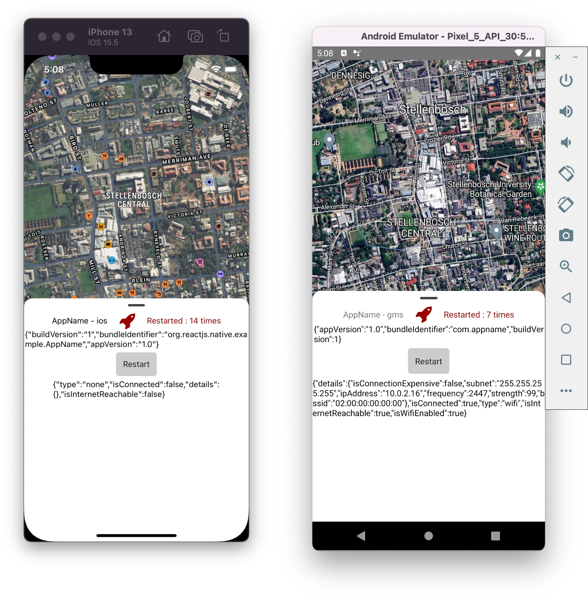

# React Native Template with Google / Huawai Mobile Services detection

A simple React Native 68.2 template with the following features:

- All TypeScript
- Eslint & Prettier configured
- Google and Huawai Mobile Services detection
- [React Native Firebase](https://rnfirebase.io/) notifications for iOS and Android
- [React Navigation v6](https://reactnavigation.org/docs/getting-started/)
- [React Native Map components](https://github.com/react-native-maps/react-native-maps) for iOS and Android
- [React Native Huawai Map components](https://github.com/HMS-Core/hms-react-native-plugin/tree/master/react-native-hms-map) for Huawai
- [WatermelonDB](https://nozbe.github.io/WatermelonDB/) reactive offline sqlite database
- [Vector Icons](https://oblador.github.io/react-native-vector-icons/)
- [React Native Bottom Sheet](https://gorhom.github.io/react-native-bottom-sheet/)
- [React Native Network Info API](https://github.com/react-native-netinfo/react-native-netinfo#readme) 
- [Day.js](https://github.com/iamkun/dayjs/)

## Installation

> Be sure to have the [React Native CLI](https://reactnative.dev/docs/environment-setup) installed.

```bash
npx react-native init AppName --template https://github.com/react-native-template-gms-hms/react-native-template-gms-hms
```

## Google Maps setup
For Google Maps to work you need to add a valid key to [`AndroidManifest.xml`](https://developers.google.com/maps/documentation/android-sdk/start#add-key). Only the key is needed, no other configuration is necessary.
```xml
<meta-data android:name="com.google.android.geo.API_KEY" android:value="${MAPS_API_KEY}" />
```

## Firebase setup
Android - Download the google-services.json file. Place it inside of your project at the following location: /android/app/google-services.json
iOS - Download the GoogleService-Info.plist file. Place it inside of your project at the following location: /ios/GoogleService-Info.plist

## Usage

- Run on iOS: `yarn ios` or `npm run ios`
- Run on Android: `yarn android` or `npm run android`
- Lint Code: `yarn lint--fix` or `npm run lint--fix`
- Format Code: `yarn prettier--write` or `npm run prettier--write`

## Screenshots


